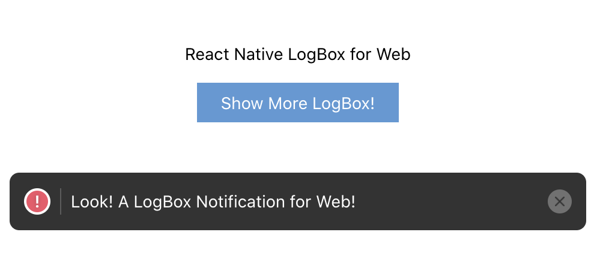

<div align="center">
<h1>react-native-web-log-box</h1>
<p>A web drop-in replacement for React Native's LogBox</p>
</div>

---

<div align="center">

</div>

---

## The Problem

You want to see console errors directly on pages without opening DevTools during development when developing for React Native for Web, like [React Native's LogBox](https://reactnative.dev/blog/2020/07/06/version-0.63).

## The Solution

react-native-web-log-box implements React Native's LogBox and can be used as a drop-in replacement.

Most of the code is taken directly from React Native's codebase and has been carefully adjusted to work on the Web.

## Installation

```
yarn add react-native-web-log-box

or

npm install react-native-web-log-box
```

## Setup

`react-native-web-log-box` works across Web, iOS and Android.
Expo projects (Managed and Bare Workflow) are also support.
ed.

When targeting iOS and Android, React Native's native implementation is used.

```typescript
import * as React from 'react'
import { LogBox, LogBoxNotification } from 'react-native-web-log-box'

LogBox.ignoreLogs(['Keywords or regexes ignore'])
LogBox.install()

function App() {
  return (
    <>
      {/* Put your app components before <LogBoxNotification />  */}
      <LogBoxNotification />
    </>
  )
}
```

LogBox is only used for development, so LogBox will be replaced with stub implementation and have no effect on production bundles.

For general information on React Native's LogBox, please refer to [API documentation](https://reactnative.dev/docs/debugging#logbox).

## Limitations

Only console errors and warnings are captured in `react-native-web-log-box` and fullscreen error overlays are not implemented. You can open DevTools to see full errors and warnings.

Frameworks such as Next.js, Expo for Web and Create React App already capture uncaught exceptions and display in-built full-screen error overlays, so please use them for exceptions.
